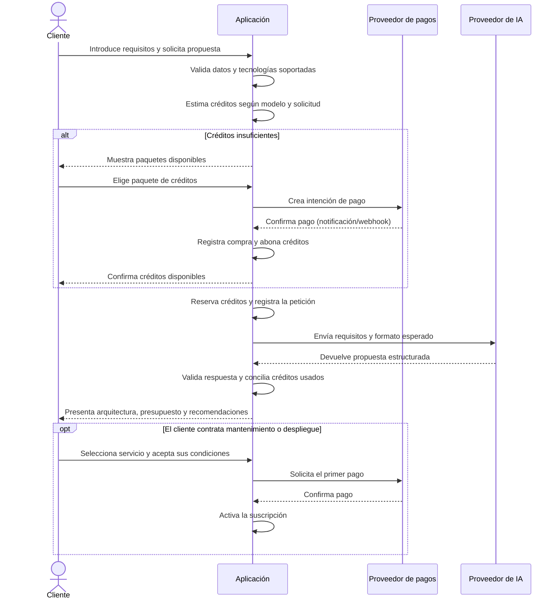

# Actores y flujos — propuesta técnica inicial

## Alcance

La aplicación recibe los requisitos de un cliente y genera una propuesta de arquitectura y presupuesto con IA. El cliente puede consumir créditos para obtenerla y, si le interesa, contratar mantenimiento o despliegue como servicios adicionales.

**Límite importante:** que la IA recomiende mantenimiento o despliegue no debe contratar esos servicios ni iniciar un despliegue. Ambas acciones requieren aceptación explícita del cliente.

## Actores

| Actor | Tipo | Responsabilidad |
|---|---|---|
| Cliente | Usuario | Configura su proyecto, compra créditos, solicita propuestas y decide si contrata servicios adicionales. |
| Administrador de catálogo | Usuario interno propuesto | Mantiene productos, precios, tecnologías y recursos ofrecidos. En el MVP puede ser una función interna sencilla. |
| Equipo técnico/soporte | Usuario interno propuesto | Atiende incidencias de mantenimiento y revisa los despliegues contratados. |
| Proveedor de IA | Sistema externo | Recibe los requisitos y devuelve una propuesta estructurada. |
| Proveedor de pagos | Sistema externo | Procesa compras y pagos recurrentes, y notifica su resultado. |
| Plataforma de infraestructura | Sistema externo, solo si hay despliegue real | Aprovisiona los recursos contratados. Si el producto solo recomienda infraestructura, este actor queda fuera del flujo inicial. |

La aplicación es el sistema bajo diseño, no un actor externo. `PermisoUsuario` puede servir para diferenciar cliente, administrador y equipo técnico.

## Flujo principal: generar una propuesta

### Reglas técnicas del flujo

1. Validar la petición contra el catálogo de tecnologías y recursos soportados antes de llamar al modelo.
2. Calcular el coste en créditos en el sistema, según el modelo elegido y el uso medido; no confiar en un coste devuelto por la IA.
3. Reservar créditos al iniciar el procesamiento y liquidar el consumo al terminar. Si falla el proveedor o la respuesta no supera la validación, liberar la reserva o aplicar la política de reintento definida.
4. Aceptar la compra solo cuando el proveedor confirme el pago. La notificación debe procesarse de forma idempotente para no abonar créditos dos veces.
5. Validar la respuesta de IA con un esquema estructurado antes de guardarla o mostrarla.
6. Mantener separadas las recomendaciones de la IA y las decisiones del cliente. Por ejemplo: `mantenimiento_recomendado` no equivale a `mantenimiento_contratado`.

## Flujos secundarios

### Compra de créditos

1. El cliente selecciona un paquete y ve su precio y condiciones.
2. La aplicación crea una compra pendiente y solicita el pago.
3. Al recibir confirmación del proveedor, registra el pago y un movimiento positivo de créditos.
4. Si el pago falla o queda pendiente, no concede créditos todavía.

### Contratación de mantenimiento

1. El cliente elige el plan y revisa tecnologías cubiertas, precio, periodicidad y condiciones.
2. Acepta explícitamente las condiciones y autoriza el pago.
3. La aplicación activa la suscripción tras la confirmación del proveedor y registra sus fechas y estado.
4. El equipo técnico presta el servicio mientras la suscripción esté vigente.

### Contratación y ejecución de un despliegue

1. La propuesta indica los recursos y el coste estimado; el cliente los revisa.
2. El cliente acepta el plan de despliegue y sus condiciones comerciales.
3. Tras el pago y la autorización final, se crea la suscripción/orden de despliegue.
4. Si el producto incluye despliegue real, la aplicación solicita el aprovisionamiento a la plataforma de infraestructura y registra su resultado. Si no lo incluye, el flujo termina en la recomendación y contratación del servicio.

### Cancelación de una suscripción

1. El cliente solicita la cancelación de una suscripción concreta.
2. La aplicación registra la solicitud y calcula su efecto según las condiciones aceptadas.
3. Confirma la fecha efectiva y notifica al proveedor de pagos si corresponde.

La fecha efectiva, los reembolsos y cualquier cargo por cancelación quedan pendientes de definir: los apuntes actuales mencionan condiciones distintas para la suscripción anual y el despliegue con pagos mensuales.

## Estados sugeridos para el seguimiento

- **Petición:** `borrador` → `validada` → `procesando` → `completada` / `fallida`.
- **Compra/pago:** `pendiente` → `confirmado` / `fallido` / `reembolsado`.
- **Suscripción:** `pendiente_de_pago` → `activa` → `cancelación_solicitada` → `cancelada` / `vencida`.
- **Despliegue real, si aplica:** `pendiente_de_aprobación` → `pendiente` → `en_proceso` → `activo` / `fallido`.

## Encaje con las entidades anotadas

- `Usuario` y `PermisoUsuario`: identidad y roles.
- `Productos`, `Tecnología`, `TipoDeTecnología` y `TipoDeRecurso`: catálogo, límites de soporte y recursos que se pueden recomendar o contratar.
- `PeticiónCliente` y `Propuesta`: solicitud del cliente, resultado de IA, modelo utilizado y consumo calculado.
- `CompraProductos`, `Pago` y `Suscripción`: compras, confirmación de pagos y servicios contratados.
- `SolicitudCancelaciónSuscripción`: petición y resultado de cancelación.
- **Entidad que conviene añadir:** `MovimientoCrédito` (compra, reserva, consumo, liberación o ajuste), para poder auditar el saldo sin sobrescribirlo.

## Decisiones por cerrar antes de fijar el modelo

1. ¿La aplicación solo recomienda un despliegue o también aprovisiona infraestructura?
2. ¿Los créditos caducan? ¿Se reembolsan si una petición falla?
3. ¿Qué paquetes, modelos y fórmula de conversión a créditos se ofrecerán?
4. ¿Mantenimiento se cobra anualmente y despliegue mensualmente, o ambos tienen otra periodicidad?
5. ¿Qué política de cancelación se aplica? Hay que resolver la diferencia entre el plazo de 15 días y el cargo proporcional mencionado en los apuntes.
6. ¿El cliente elige expresamente pedir soporte/despliegue, o la IA solo puede recomendarlo? Propuesta: el cliente elige y la IA recomienda; son datos distintos.
